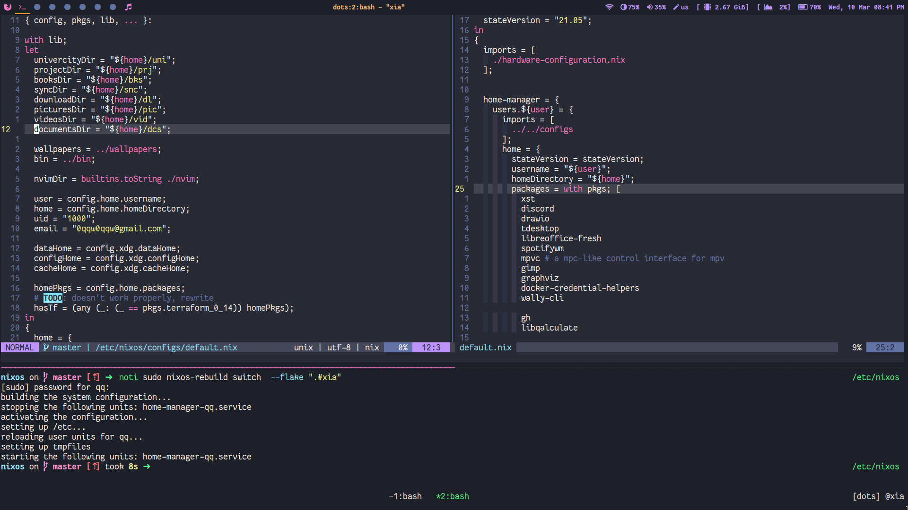

# My dotfiles


Always messy, always WIP.
## Installation

Configure the wifi
```sh
wpa_supplicant -B -i interface_name -c <(wpa_passphrase 'SSID' 'key')
```

Clone the repo
```sh
nix-shell -p git nixFlakes
git clone https://github.com/0qq/dotfiles
```

Partition the disks
```sh
dotfiles/hosts/xia/part.sh
```

Install nixos
```sh
mv dotfiles /mnt/etc/nixos
nixos-install --root /mnt --flake /mnt/etc/nixos#xia
```
## Inspiration
- https://github.com/hlissner/dotfiles
- https://github.com/mjlbach/nix-dotfiles
